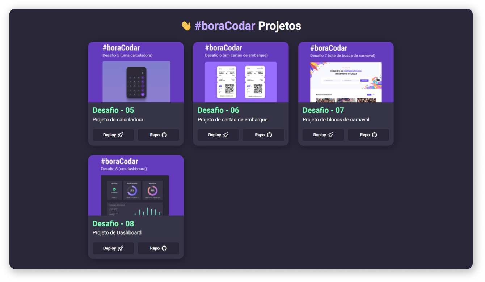

<h1 align="center">
  
  Bem Vindo ao Bora Codar
</h1>
<p align="center">🌐🚀 Este projeto foi desenvolvido com o intuito de proporcionar uma Home page contendo todos os #boraCodar solucionados.</p>

<p align="center">
  <a href="#-tecnologias">Tecnologias</a>&nbsp;&nbsp;&nbsp;|&nbsp;&nbsp;&nbsp;
  <a href="#-ferramentas">Ferramentas</a>&nbsp;&nbsp;&nbsp;|&nbsp;&nbsp;&nbsp;
  <a href="#-execução">Execução</a>&nbsp;&nbsp;&nbsp;|&nbsp;&nbsp;&nbsp;
  <a href="#-layout">Layout</a>&nbsp;&nbsp;&nbsp;|&nbsp;&nbsp;&nbsp;
  <a href="#-autor">Autor</a>
</p>

<div align="center">



</div>

<p align="center">
  <a href="#" target="_blank">
    
  </a>
  <a href="https://twitter.com/Wesley_AllanS" target="_blank">
    
  </a>
</p>

## [✨ Deploy](https://wesleyallan.github.io/bora-codar)

## 🚀 Tecnologias
Tecnologias utilizadas no desenvolvimento no código do projeto.

- HTML
- CSS
- JavaScript

## 🔧 Ferramentas
Ferramentas utilizadas para o desenvolvimento e ou manutenção do código do projeto.

- Visual Studio Code
- Git
- Figma

## ⚙ Execução

Para visualizar o resultado do códigos, apos clonar o repositório basta abrir o arquivo HTML no navegador ou iniciar um servidor simples usando de soluções como `http-server`, `Live Server`, entre outros.

```sh
git clone https://github.com/wesleyallan/bora-codar
cd calculator
```

## 📑 Layout

Você pode acessar o layout dos projetos através do [Figma](https://www.figma.com/@rocketseat) da Rocketseat.

## 👤 Autor

**Wesley Silva**

- Website: [wesleyallan.dev](https://wesleyallan.dev)
- Twitter: [@Wesley_AllanS](https://twitter.com/Wesley_AllanS)
- Github: [@wesleyallan](https://github.com/wesleyallan)
- LinkedIn: [@wesleyallan](https://linkedin.com/in/wesleyallan)

## Mostre seu apoio

Dê um ⭐️ se esse projeto te ajudou!
