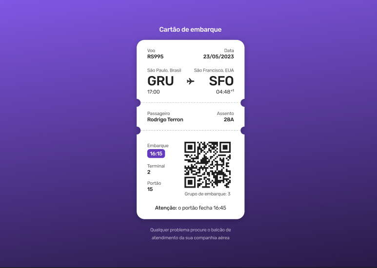

<h1 align="center">
  
  #boraCodar 06 - Cartão de Embarque
</h1>

🌐🚀 Resoluções e correções do desafios 06, um projeto de cartão de embarque.

  
  

- [✨ Deploy - Resolução](https://wesleyallan.github.io/bora-codar/06/resolucao/)
- [✨ Deploy - Correção](https://wesleyallan.github.io/bora-codar/06/correcao/)

 

## 🚀 Tecnologias

| Tecnologia | Descrição                 |
| ---------- | ------------------------- |
| HTML       | HyperText Markup Language |
| CSS        | Cascading Style Sheets    |

## ⚙ Executar

Para visualizar o resultado do códigos, basta abrir o arquivo HTML no navegador ou iniciar um servidor simples usando de soluções como `http-server`.

## 📑 Layout

Você pode acessar o layout do projeto do cartão de embarque através do [Figma](https://www.figma.com/community/file/1205146101173113980) da Rocketseat.

## 👤 Autor

**Wesley Silva**

- Website: [wesleyallan.dev](https://wesleyallan.dev)
- Twitter: [@Wesley_AllanS](https://twitter.com/Wesley_AllanS)
- Github: [@wesleyallan](https://github.com/wesleyallan)
- LinkedIn: [@wesleyallan](https://linkedin.com/in/wesleyallan)

## Mostre seu apoio

Dê um ⭐️ se esse projeto te ajudou!
